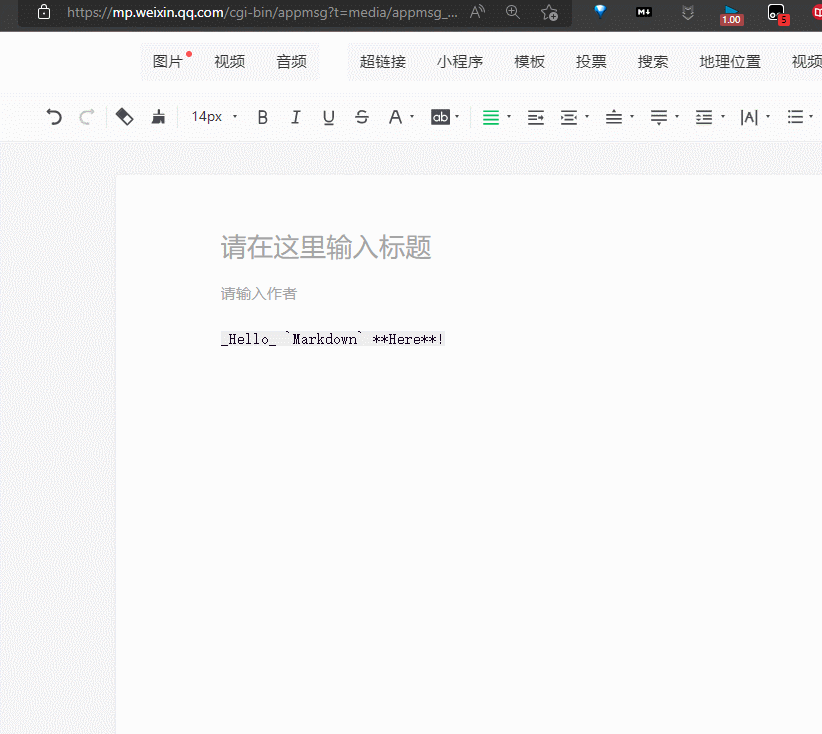

* content
{:toc}


### 一 简介

#### 1 什么是markdown

​	Markdown是一种轻量级标记**语言**，创始人为约翰-格鲁伯（John Gruber）。它允许人们使用易读易写的纯文本格式编写文档，然后转换成有效的XHTML（或者HTML）文档。这种语言吸收了很多在电子邮件中已有的纯文本标记的特性。
​	由于Markdown的轻量化、易读易写特性，并且对于图片，图表、数学式都有支持，许多网站都广泛使用Markdown来撰写帮助文档或是用于论坛上发表消息。如GitHub，Reddit，Diaspora，Stack Exchange，OpenStreetMap，SourceForge、简书等，甚至还能被使用来撰写电子书。

-------来自百度百科

#### 2 为什么我们需要markdown

- 在我们需要进行记笔记时, 我们对于格式( 例如, 字号, 段间距)并没有太大的要求, 反而对结构有要求, 例如标题是什么, 这个标题下有几个小标题, 对于我们的要求来讲, word 显得过于臃肿,  
- markdown 是 latex 和 word 的一个 trade-off
- 因为他的轻量化, 导致他的格式固定, 使用不同的平台不会出现 word 那样不兼容的问题
- 因为是近几年才出现的( 04年 ), 能够更贴近这个时代, 例如md文件本身不保存图片, 这就可以使用网络上的图床, 让专业的人干专业的事

#### 3 markdown 工具( 软件 )

Typora( 强推 )[Typora 官方中文站](https://typoraio.cn/)、MacDown

#### 4 markdown 插件

```
markdown here [Markdown Here](https://markdown-here.com/)
markdownload [markdownload](https://microsoftedge.microsoft.com/addons/detail/hajanaajapkhaabfcofdjgjnlgkdkknm)
```


### 二 markdown 语法

#### 1 标题 '#' 号----生成文章的结构

- 后面需要一个空格
- 一个是一级标题, 两个是二级标题, 依次类推, 越少代表优先级越高,
- 被用来生成文章的结构, 我经常用###代表目录, ####代表子目录

```markdown
### 第一章
#### 第一章第一节
#### 第一章第二节
```

#### 2 无序列表

```markdown
使用- (注意后面有空格)
```

#### 3 网址

```markdown
[显示内容](网址)
例如上文的
[Typora 官方中文站](https://typoraio.cn/)
```

#### 4 图片

```markdown


# 图片 base 64 
![csdn图片Base64][csdn]
 
[csdn]:data:image/png;base64,iVBORw0KGgoAAAANSUhEUgAAALQAAABYCAYAAABcS93LAAATuUlEQVR4Xu1dCXBc5ZH++h/5tjHmMjaXAVuyjTSaN/PkY55sK5tjgbBJCDjh2Cy7LMdWQsgCIZUKCRtvkU2RBRI24UhlKY5ANpCCLNcCGwIKmifZ0pt5MyMi27I4YogDwRjbeC0saV5v/bLkGkmjeceMnampv6soqvy6++/u/5v3+u+//18ERSoCVRQBqiJflCsqAlCAViCoqggoQFfVdCpnFKAVBqoqAgrQVTWdyhkFaIWBqoqAAnRVTadyRgFaYaCqIqAAXVXTqZxRgFYYqKoIKEBX1XQqZxSgFQaqKgIK0FU1ncoZBWiFgaqKgAJ0VU2nckYBWmGgqiKgAF1V06mcUYBWGKiqCChAV9V0KmcUoBUGqioCCtBVNZ3KGQVohYGqioACdFVNp3JGAVphoKoioABdVdOpnPmLAzrb0DBvJtFKB6hnYCmARQScyMAJAGYAmE6AYCAH4AAB+wHsYaL3mHkHAduIuddhTtW9+uqrBDilTev6UDT69umOELVwME8IzHYIc8A866BeGgQw/J+As59Be0nwBxgK7SSiHclk27so2YY8D9avD+FXv5K+VxKRpq05DuCFRM6xLDAPELMIPIMZRARm8H4G9oZYvAPQ9mSy7U9HwoEjDujHgJDW0NDsEP0NgLPBvAxEokzOfij27z9+SV/fAa/6GhtXn0QhOlcQrWNCBIzFIEzzKj+RjwcAvMZM3QTaJOA8mUy2vzaeL6ob1zBoBYPnEyQgeB5A8kczC+DpzKihkbgws0NEAyD0g7EL4PeZsYNIvA52+ojJnjbNyXR0dPQHt3uiZCy2ZkGOnHqScyTEUjAvBnA6gFMBTPU51l4AKTBeIaanUqlE0qe8J/YjBuieZctOq5ky5UoAlzFwsifr/DPtqstmj3UTW7SoZfoxxw9dzIwrAF4tX7tuMoGfM99uJ9u/Pl4+ohtbCKgLrHei4BBAnSB+3gGeyHSZvw+qW9PjDwF0NoDjg+pwlWNkiOjulLXgPqB8X6DDN5EjHvUtX744V1PzbQCXAJji6mhpDOm6bFYrokJoMeMqEL4DYGFpQ3mTZqKvpLsSdxcA9F4C5njTEoSLOon4P1Jd5n/5TYEiuvE+AccEGdW3DCETYnGVZbV1+pYtIHDYAP1OODxrL9HNzPw1oJRPuHc3CXiqNpv9bCGJBr35jBD4FwSs9K6xLJzn2pb5XL6m5ctbZk+bOfhhWbS7KqHNDHw5bSVaXVkBxGKxKQ5NlynbYcNGATs+cgiXZbrMx7zYWIznsBi9tbFxBTE/zMCSUg30JU90V10mc814mViseaVDzrMAuaYjvsbzwJwDlmYtc2s+aySydgnV5Ho9iJeHRebgoDtSSfMbALiYUrmmEFPE2+UZ2JeWHAPnpC3zN76kxjGXHdDbGhsvzzHfS4c/vZjgNxN9c2kmc2v+g7Bu1IUYHSC58DqyJBdz+/bMndnX99yYRarWFF8Lpt8dWWuG37m/sLvMLxVLQWKxVVGHQodlwebB3539YnDpls7O9z3wFmQpK6B7Gxq+A6INXIbPFQP7BbBP/p+Yh5hoJh0s4x3FQKiQNwRcUpvNypxxlISmGzI3iwUI0BAYbwLYDsI+ZuRAPJWGKxF81MjbXi6aZk6qm/FHO2lOWABrevwigPLtLKhipLrRL0uRfLCqUEL1ZXQIusO2EjdMZnO0qflsZh6TIgWIXXAR4tvtromLaK8KywborY2NN4D5Nq8Dj+OT9eTfMPAyiDbPHBzsO6WnZ1chXRLMvY2NJ9bkcgsc4AwIsYyBKDMbEOJzdZlMYlTOK3Dyx2HgfwG+u38avbTVNF3z3FgsNndITD+ZHJb18zMIWMqEswDSwMjYSXPteD+iunEdA3cUixUx35lKtl+f/zZdv359aPv27bMGB6cuYpFbTqCoA1wgx/URdyYhzkl1tr1QSCYSMy4jwgOu+ggPgtHGoNcc8J9CObErl5uxf2hogGbPDk0bGho4ySGuJ3LOBujCkT0FV7UA9n6wc8r8N99s/cgL83iesgC6NxL5NDvO0z4XEizBI5hvq+3ufjGI8eOAKNDSIqi1dWj03yN68zME/rRH3TK3vNK2zPs88ruxifDKloXZTa0T8tGIbvyAgBuLKWDgurRl/shtEPk8oq8xBJzb2eOCl4E3QvxRXTKZlBtEYyiqx7/BoDFpW0EbcjjJts0dXuzTNGMhQngQwCe88AP4rG2ZT3nkHcNWMqC3aNpCGhrKgnwtuGQg/q4um/1tEKO9ymi68WcftdQnbcv8nFfdpfBFdOPnBPxtcR18sW21/9LHOLIkeRMI/+pFhoguT3Ul7h/PqzXFbwPTpCnJCD8f2P/B9J6eHrmJ5IkWL148bc7R8+XXU3cVYHzfTprfcuUrwFAyoHsbGx9m5ks9D07Uhf7+c+t6e3d6lgnIqOmGfFsXzLcnqGS6x04mvhxwKF9imt78IsAfLypEosXuavO9cNRixvdB+KYHg0zbMpvH83n7sWG3bZm+F9kR3fgkDad0rvS0bZmfceUqN6C31NfrJIRcdHn6YTDz9qFcbmV9T887QYz1K6Ppxh+9b6DwHkBcaFuJktMfNzu1WHMPiJcV4ytU7nPTK5+3tLTU7Nk3KEuCcot6cmJ2BEInj++x0HRDAu6TRUWBrWnLlH03vmjEtt0Ht/eLjtBpW+2B9gs8AXGyoX2+nVkwG0u6uzt8RaEEZk1vfghgWabyQ11gehwhPG93JrJudVs/ikd5Nd34AMDRxWSnhobmbtq0SfY/+KaoblzNwL1ugszi/HSy7b/z+bSYkQEh7CLbalvmx9z0F3oe1Y0t7LrlT5ttK7E8iP7AgH5Nru4HB2WO6qlJhYGnl2azgT4jQRyTMmE9Xi+YLArebPQeM14WRL8dBF7sthKvB7VlVG716tUzPhoUsmOwGO23LdPlLTa5eDgcPyE0leRXsOj8Mvi7aat9wxhA64bsijux6PuT8Ug6abqsAQpr8NjD8nvbMuuDxDowoLfU13+BhHjU86DM59d1d495G3iWLYHRS4nMs3rmbSDxtMP8zLw5U9pa8yoqXnXILfga8ITuu3x5Bl5PW+aZXnUW4tM8ABNE99hdY9YNsm4vF3ou6w661bYSXvL0CaZpevNbALs1p3XZlrkiiP+BAd3b0HAvE13tcdAhPnDgmKVbt7rWdT3q88UWaTK+TowfuL2xfCkFdoDxoADfV6g9dDJdssRGcA7VyifhK7hg82OfFjPSIDQWl6Ff2lbi4lGe+pUr50/J1bivb5ivtZPtP/Zjj+QdyaFlfdltof68bZnn+NUv+QMDems43AZgwiq5oBHMfXXd3Ue2r2OcIbFY/FMOkcwriy+W/EcxR4SfO6HchvTGjXJnsShFYs3riditCedx2zLlZkRg0nTDctshZeDhtDW8FT5MjfpqTUCk3AflC22r/XF3vrEckciqRVQTesNNjhkPpJPmP7jxFXoeGNC94fA7DMz3MigRtdZmMoEWEV70e+UJh8OzxJQ51xLwz6DhEzHlpH4w32An2+8pplSLxa8F0Z3FeBi4K22ZE5qs/Bir6cY2ALIhvxj91LbMfxpliK5oPo8dlhtkxUlw3O5s9724j+jNLQR+2U09Af+Wssyb3PjKCuit4bBc2MjeClci4IXabFY2jFcEyYVZ/4C4lAjy7bSmlC/VeIeI6WepZOKqyRz1Uicm0LdTVuJ7QYM1svDc49Z/zuANaav9u4cA7bU6MpQ7PZ12/xqNtz8SNS4lgYfd/CLgqynL/IkbX7kBLTvIPFU4CNhYm83KkyEVR5FVqxZRruYzYJY52zqvP9JijhBoQ8pKHAJKPq/WZDwAxmUugbiilC34aNRYwwKvuAfbucS2Og41SWkxYwMIN7vI8Ye7353R5+OY26i+iG7cSBheyxQlIlyQ6jKfcOMrL6AbGnaAaIGXQQnYvSSbPbb0A6xeRgvOI99sAwNiVY54rQCtY2BVIIAzDgjwWYUWixHdeIGATxWzkpnPSyfbnw3qSbTJuJ8Zf+8mL9hZlkx2bBnl03TjPwH8o4vc+7ZlHuemu9DziG7cQcB1rrI5jtu2/5RG6g2cQ28Nh+VK3XA1boTBYW5Z1t3teyvXq/7DwXfy6tUzThgKrWPwRWC+GCBPX6RhW4hvsbva5VGvMRTRjW4CitZYBYtYMtnmYXE20evwirWnh5ycBGlRWxn8dtpqPyVfg6Ybsm3UJTWkbttKuG28FJwOTTdkb8oXXecqx4tsu/0PrnwFGAIDujcc/iHLxZVHIubW2u7uv/jC0KO5E9ii0TVhFk67+7btIdGCu2mabsgeluInZ3x0suUbOtIAJKtPTR78/IltmV8dC+jmLMANRWWZXrCTiUDrIS1mvAIaXrMUI9+NT/nKAgO6r7HxYznmlzwE7hCLAK5Yks2Wqz3Tz9Bl4fWSLuQNZNmWOQZYI4CTVw1MGnfZ1H/0nKnT/G7aSN1HzZ3/EBO+4MVZwU44mezozuf1cjiWQfenrcTlXsYYz+Ox8rLTtszAp80DA5oB0RsO9/mp65K8LIboytpMZkLbYpAAHWEZ2Z75GgiLvIzLQCJtmWPeRpoWPw0hKl6rZvzZTpqeyqGjdoycA5S7tp5SQAI9m7IS5+X7sailZfq8fYOyclUUE6WU1DTd+L+iJ3wOGpS1LdNlQ2jyGQgMaKlyWzh8hQP8zMsEj/ssPBMS4voz02lZKy07yfQgR85RmaQpU4QSb1I6aF5Ej/8LgQpWLgo5UKiWrGnx1QiRtGlyOnjKJeIlKHV1xpyZs+lrIJbb0F57PwbIyUVSqY2b88eIxeJnOkTyBVWUCHRNykrc5cY3/nks9om5DvXLTjs3CrxLKBWXBOjh41DhsAmPJyXGeMLsgKg9RPToAHP7jGOO6Tm91f3YzR8aGub1M59JodAyYtaJ+aUl3d1P5uuO6vGbGHQLA7tA+J1gdAw5nJxCU7PJZKuvPmxthaFTDt9iwvluM5H/3GH8VSZpjtlEiDYZn2dG8R025hfsZPukOerKlSvnD+RqVjKwnjBsk1cgD5vHhBvTXeaEo3KaFl+LkPvB3aAltWh07TIWuR63GJaS0pQMaKlgc2NjLTFvPHidVUkk7297E8y7QCQPx+6T94Ox3Lxhngui4wk4gccdSiXgwtpsdgxIInr8pwSabHNjNwFvyGNIBGxnxl4aPgTL+1hgCBAzBbMcRzYHydq5vPbKL3XYlhkfLxTVm7/CYLcNA5ljy1uPdjAPx4AdQXOJeR4BpzIwpjLhxzAiPJbqMi8q1BLr9fwlOVidSpkb/YwreTVtzccRclx7zQn0vZSVkBcTBaKS3tCjI27TtHWcy/3PeLAFssinEAvRvDSdll+JQ6TF4s+D6K99qioPO2OfI7Cq0FVcUb35FgYH2tItg3FPC/7ogkLnCIcBF2u+AeR+yFkwTksmze1+7dH05i8B/JCbHIOuSQdIaUb1lgXQUtmWSMQgx5EHG4/MFVIjHhDzmbXd3WP6lDU93gNQ0RMhboEN8pwZBwC+YLJNEU2P3wdQoApBEHtGZOR9oD+2uxZcX+wOOU1vvh1gecq8GAUuqXk9fOs49PlMKvHroP6WDdDSgB5NOy2Uy8m9em9deEGtzpObOWvWzFPG3bqp6cY+v7llqaYw+F2i0BeLnQP0tnFRqiVj5HeQQ1enUoln3LR63PR4z7bMQE1dkVj8R0Qkr4UrSjmmVdlkYpMb32TPywpoOYgs5/WFw5c7wC3w2I1XgvG7a7PZMbl7LNZynEOD7wXVGUBOXsfwiDPAN2Sz7fIEz6TkrUc5gAUTRHgPmO480D/l33t6WuWP25UiutFGbi8iHxWY8QNGYsaj5KFGPkihU1/teuUtV4MnYSg7oEfH2RGLzfxwcFD2E1wL1zNkwcwnYHNtNjvm7Fljk3EWOZwdvVs5mGYPUjK9IHoCArfanYmMBwloMePdw9C2Ojq0/GF1EvMj+6fTA14uycm3WdMNmba59YoHLql5+8HIg7sHpk+W53uJ8WEDdP7gmxsaYkKIC8EsLxqR1926nVjwYjvA/Fhdd/eE3oCmprWnDME5H8xnM9Bcxmtr9zKoDURPhpzQr32WAElran4OjnMGQKeWdqn6cHjkAVpZDckScSJXwy9nOjrkKfdAFNWNH4KL96o44M500pQXxvgmrcm4mRwqumHEQL+dTEy4S9vPYEcE0PkGbVu8+CieMSPCRPUE1IJoITPLrr25BEwfvb8t/09QsPwTFMAuInqHHWd7iEg236SWZLNebskUjU3GMnKokQQvlddmMeMUef8xM2aDMFvm28wQIAwQo58JHxD4fYDeAoZ39nogkLE7F7xapsu5KRJpmYtp/ceLwZpjHSH/5IWYJYQzKweeSg6FCPIGf/mnHQ7+CQxm+pDh7HHg7Azlpr2VTrd62aTwg4Wq4D3igK6KqCknKjYCCtAVOzXKsCARUIAOEjUlU7ERUICu2KlRhgWJgAJ0kKgpmYqNgAJ0xU6NMixIBBSgg0RNyVRsBBSgK3ZqlGFBIqAAHSRqSqZiI6AAXbFTowwLEgEF6CBRUzIVGwEF6IqdGmVYkAgoQAeJmpKp2AgoQFfs1CjDgkRAATpI1JRMxUZAAbpip0YZFiQCCtBBoqZkKjYCCtAVOzXKsCARUIAOEjUlU7ERUICu2KlRhgWJgAJ0kKgpmYqNgAJ0xU6NMixIBBSgg0RNyVRsBBSgK3ZqlGFBIqAAHSRqSqZiI6AAXbFTowwLEoH/B5Gu0rNlwMl/AAAAAElFTkSuQmCC
```


#### 5 代码

> 使用```(数字1前面的那个)

#### 6 引用

```markdown
> (小于号)
```


### 三 markdown 与浏览器交互

#### 3.1 markdown here------将markdown上传为 html 格式

下载地址：[Markdown Here微软商店下载地址](https://markdown-here.com/)

**使用方法**    :   点击插件图标或者是, alt + ctrl + M (动画在下面)

- [GIF 2022-9-11 20-27-10](../../assets/gif/love_markdown_1.gif)



设置格式  : 右键浏览器插件图标 -> 扩展选项-> 基本渲染CSS

- 


还可以使用 latex公式使用$$包裹起来


----


#### 3.2 将网页下载为markdown

- 下载地址：[markdownload_微软商店下载](https://microsoftedge.microsoft.com/addons/detail/hajanaajapkhaabfcofdjgjnlgkdkknm)

**使用方法**:   点击图标 -> Download

- 


### 四 图床

有了图床的 markdown 才是完整的markdown

#### 1 介绍

图床（Image Hosting Service）是一种用于存储和分享图片的**在线服务**。它允许用户上传图片文件，并生成一个可访问的 URL 地址，用户可以通过该地址在网页上或其他平台上分享图片。图床通常提供免费和付费两种服务，用户可以根据需要选择合适的方案使用。

图床的主要功能包括：

1. 图片存储：用户可以将图片文件上传到图床服务器上进行存储，这些图片文件可以是网页中的配图、产品图片、个人照片等。
2. 图片分享：图床为用户生成的图片 URL 地址可以方便地在网页、论坛、社交媒体等平台上分享图片内容，用户只需复制图片链接即可。
3. 图片管理：图床通常提供图片管理功能，允许用户对上传的图片进行管理，包括查看、编辑、删除等操作。
4. 图片处理：一些高级图床服务还提供图片处理功能，如裁剪、旋转、压缩等，使用户可以在图床上直接对图片进行编辑处理。

使用图床的好处包括：

- 节省空间：通过将图片上传到图床服务器，可以减轻自己网站或应用的服务器负担，节省存储空间。
- 加快加载速度：使用图床存储图片可以加速网站或应用的加载速度，因为图床通常会使用 CDN（内容分发网络）技术，将图片文件分发到全球各地的服务器节点，使用户可以从距离更近的服务器获取图片，从而加快加载速度。
- 方便分享：图床生成的图片 URL 地址可以方便地在各种平台上分享图片内容，无需担心图片被删除或地址失效的问题。

总的来说，图床是一个方便的在线服务，可以帮助用户轻松存储、管理和分享图片。


#### 2 picgo

PicGo 是一个开源的**图片上传**工具，可以帮助用户快速**上传图片到图床**并**生成图片链接**。它提供了简洁友好的图形界面，支持多种图床服务，并且具有丰富的配置选项和插件扩展功能。可以帮助用户快速、便捷地上传和管理图片，并生成图片链接用于分享或嵌入网页。


 PicGo 的主要特点和功能有：

1. **支持多种图床服务**：PicGo 支持丰富的图床服务，包括但不限于 GitHub、七牛云、阿里云、腾讯云、Imgur 等。用户可以根据自己的需求选择合适的图床服务进行配置和使用。
2. **多种上传方式**：PicGo 提供了多种上传方式，包括拖拽上传、剪贴板上传、截图上传等。用户可以根据自己的习惯和需求选择合适的上传方式。
3. **支持快捷键操作**：PicGo 支持自定义快捷键，用户可以通过快捷键实现快速上传图片、截图等操作，提高工作效率。
4. **自定义命名规则**：PicGo 支持用户自定义图片文件名的命名规则，包括时间格式、文件名格式等，使用户可以根据自己的需求对上传的图片进行命名。
5. **图片处理功能**：PicGo 提供了一些简单的图片处理功能，如图片压缩、图片裁剪等，用户可以在上传图片之前对图片进行简单的处理。
6. **丰富的插件扩展**：PicGo 支持插件扩展，用户可以根据自己的需求安装各种插件，扩展 PicGo 的功能和特性，例如支持更多图床服务、添加更多上传方式等。
7. **跨平台支持**：PicGo 支持 Windows、macOS 和 Linux 等多个平台，用户可以在不同的操作系统上使用相同的工具和配置。
8. **开源免费**：PicGo 是开源项目，用户可以自由获取、使用和修改源代码，完全免费。


[配置手册 | PicGo](https://picgo.github.io/PicGo-Doc/zh/guide/config.html)


#### 3 [B站图床picgo 插件](https://github.com/xlzy520/picgo-plugin-bilibili)

插件在线安装

- 打开 [PicGo](https://github.com/Molunerfinn/PicGo) 详细窗口，选择 **插件设置**，搜索 **bili** 安装，然后重启应用即可。

使用方法

- 找`cookie`中的 `SESSDATA` 还有 `bli_jct` 复制即可


实现原理

- 将图片存在一个 B 站的**公共静态资源空间**。
- 举例：所有人上传的图片都会放在这个空间里面，但是你不发布动态的话，那么这个资源与你就没有绑定关系，那么你自然是找不到的。你发布了的话，你的这条动态就会跟这个图片资源绑定关系，那么查看的时候，就知道这个动态绑定了哪些图片链接，就可以看到对应的图片了。


#### 4 其他哔哩哔哩图床软件推荐


- [浏览器插件 - Bilibili 图床](https://github.com/xlzy520/bilibili-img-uploader)
- [Typora 插件 - Bilibili 图床](https://github.com/xlzy520/typora-plugin-bilibili)


### 五 typora

#### 1 主题

主题获取网站 [Themes Gallery — Typora](https://theme.typora.io/)

然后打开我们的 Typora 和 -> 文件 -> 偏好设置 -> 外观 -> 打开主题文件夹，将解压好的**文件**拖到这个 Typora 的主题文件夹

> 注意：不能解压到单独的文件夹，直接将解压的文件拖到主题文件夹中，否则会不识别


