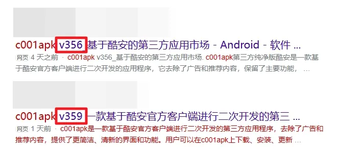

**自行打包**

c001apk 这个开源的项目，本来是有作者打包好的 apk 安装包的。

但自从这个 App 前段时间火了以后，作者担心出问题，就把 GitHub 里的 apk 安装包给下架了。

说真的，100% 理解，对于作者来说，安全第一嘛。

但你百度一下「c001apk」，会看到最近分享的帖子里，能有 7、8 个版本。

有的是以前作者打包的，有的是最近分享者打包或搬运的。

那该怎么获得最最一手的版本呢？嘿嘿，GitHub 上有源码，咱们完全可以自己编译打包。

当然，当然，如果是从头开始打包，那不得搞个 Android Studio 自己慢慢折腾？

感觉光安装编译工具就能劝退 90% 的小伙伴了，所以这里肯定不是这种传统的编译教程，而是取个巧，通过白嫖 GitHub 来一键打包。

GitHub Actions，这是 GitHub 为开发者准备的跑脚本的服务，你可以简单理解成 GitHub 准备了一个开箱即用的远程虚拟机。

虽然免费账号有限制，但对于打包一个 apk 绰绰有余了。

具体操作是 ——

1、登录自己的 GitHub 账号，然后 Fork 一下项目源码，在跳转页点「Create fork」就好了。

地址：[github.com/bggRGjQaUbCoE/c001apk](https://mp.weixin.qq.com/s/github.com/bggRGjQaUbCoE/c001apk)

2、Fork 成功后，在咱们自己的仓库里，点击「Actions」，并启用。

3、然后运行脚本。

等脚本跑完，也就是那个对号出现，咱们点进去。

这里有个「build」的选项，再点进去。

在「Upload release」里，就能找到打包好的 apk 文件了。

把压缩包下载下来，解压后就能在手机上安装了。

就是这么简单，唯一的难点，大概就是搞定 GitHub 的网络问题了。

**结语**

好了，这就是今天的全部内容了，既分享了 c001apk 这个开源的第三方客户端，又分享了 GitHub 一键打包的方案。

我顺便把最新版的 c001apk 分流到了蓝奏云，老规矩，有需要的小伙伴自取就好。

地址：[wwx.lanzouj.com/iMu6a1tmliob](https://mp.weixin.qq.com/s/wwx.lanzouj.com/iMu6a1tmliob)

授人以鱼也授人以渔，希望能帮到大家。

