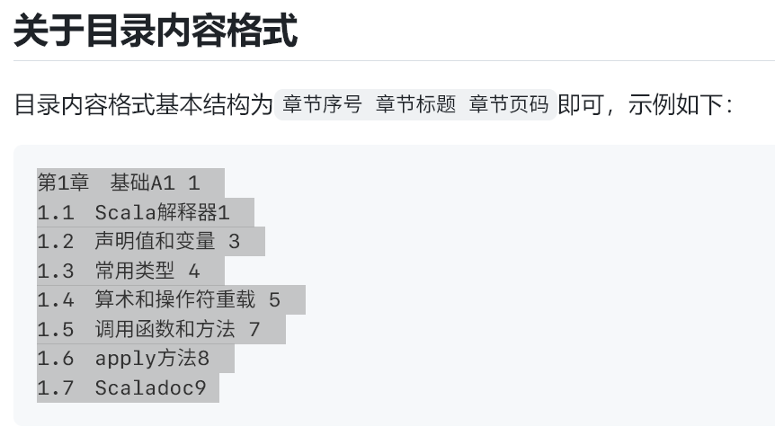
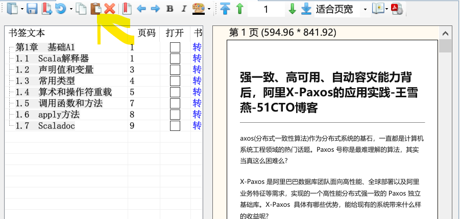

* content
{:toc}


## 小程序

| 名称       | 功能                 |
| ---------- | -------------------- |
| 粉笔证件照 | 证件照换底色，裁剪等 |
| 车来了     | 公交车到站时间       |
|            |                      |


## APP

Amarok 设置隐藏的文件和隐藏的应用。https://deltazefiro.github.io/Amarok-doc/download.html


##  PC软件

[破解软件_果核剥壳 - 互联网的净土 (ghxi.com)](https://www.ghxi.com/)


### 1 浏览器

#### 1.1 浏览器推荐

- QQ浏览器不支持密码导入、插件导入
- 360浏览器不支持密码导入，插件导入
- edge刚出的时候把chrome**同步和扩展**相关的痛点解决了，chrome般的性能与兼容性+可以同步=完美，可惜后面一个劲的加垃圾进去，变得越来越臃肿，但是又没办法替代

微软 Edge 浏览器是由微软开发的一款网页浏览器，旨在取代之前的 Internet Explorer。它最初于 2015 年发布，后来在 2019 年进行了全面重新设计，采用了基于 Chromium 开源项目的新内核，以提供更好的性能、兼容性和安全性。以下是关于微软 Edge 浏览器的一些详细介绍以及其优缺点：

**优点：**

- 微软应用商店的支持
- 不翻墙同步
- 多端同步工作,例如将`网址`推送到另一台设备上


#### 1.2 edge 设置

名称：`微软 Edge 配置百科`

- 是一款方便配置 Edge 浏览器功能的软件，选择相应功能**启用或禁用**，配置完后工具选项**重启 edge** 即可生效
- 微软的 Edge 浏览器功能越来越多，但用不上的烦人功能也越来越多，比如烦人的侧边栏还有右上角那个必应按扭等等。
- 所以出现了这款工具，几乎**涵盖了最新版 Edge 所有可配置的项**，
    设置频率较高的放在快捷菜单里直接用，一些高级设置项大多需要有经验者才能设置，而且用的频率也不高暂时没有，另外加了个重启功能，方便设置完后重启生效。

> 链接:https://caiyun.139.com/m/i?105Cpe0kUndCa
> 提取码:mA4h
> 复制内容打开移动云盘PC客户端，操作更方便哦


设置内容

关闭以下三项

- 启动增强
- 在MicrosoftEdge关闭后继续运行后台扩展和应用
- 使用硬件加速
  


#### 1.3 浏览器下载------NDM

- **免费，多系统支持**：macOS， Windows

- **暂停/恢复**功能，**高速**下载文件

- 具有**浏览器**[扩展](https://microsoftedge.microsoft.com/addons/detail/neatdownloadmanager-exten/pbghcbaeehloijjcebiflemhcebmlnke)，可以向其发送下载链接并帮助您从任何网站下载视频/音频

- **嗅探资源**

    


我的需求

- 稳定，不要提示破解（ IDM 总是提示，pass ）
- 免费
- 嗅探资源

缺点

- 嗅探不了`wangfei.tv`的视频
- 哔哩哔哩视频下载没有声音,


使用教程

- 安装
- 将`exe`放入安装地址，安装`插件`


> 链接:https://caiyun.139.com/m/i?105CpeXZ9Wch0
> 提取码:Yvcb
> 复制内容打开移动云盘PC客户端，操作更方便哦


#### 1.4 浏览器插件

- 安装时搜索并下载到`crx`格式的文件，并放在一个你之后不会不小心删掉的文件夹，因为安装之后扩展被删掉会**错误失效**
- 可以用火绒的「**弹窗拦截**」功能来解决每次启动Chrome时，浏览器右上角会弹出「**请停用以开发者模式运行的扩展程序**」
- Chrome **占用高**的原因在于它**会给每个扩展和标签页单独开一个进程**


火狐安装组件提示 “此附加组件无法安装，因为他有可能已经**损坏**” 解决方法

 解决方案：

1. 火狐地址栏输入 “about:config”, 回车会提示可能失去质保，点击 “ 我保证会小心”；
2. 搜索 “xpinstall.signatures.required”，双击 “true” 自动改为”false“; 
3. 将组件拖入浏览器安装，并检查是否安装成功。


| 插件名称                                                     | 说明                                                         |
| ------------------------------------------------------------ | ------------------------------------------------------------ |
| [onetab](https://chrome.google.com/webstore/detail/onetab/chphlpgkkbolifaimnlloiipkdnihall) | 将不看的页面保存到一个标签页中                               |
| [itab](https://chrome.google.com/webstore/detail/itab%E6%96%B0%E6%A0%87%E7%AD%BE%E9%A1%B5%E5%85%8D%E8%B4%B9chatgpt/mhloojimgilafopcmlcikiidgbbnelip/related) |                                                              |
| [Holmes](https://chrome.google.com/webstore/detail/holmes/gokficnebmomagijbakglkcmhdbchbhn) | 使用Alt+Shif+H即可搜索书签；当然你也可以在搜索框中输入*+Tab来搜索； |
|                                                              |                                                              |
| [Markdown Here](https://markdown-here.com/)                  | 写博文时可以使用markdown, 输入markdown -> 点击图标           |
| [markdown here基本渲染css](https://github.com/nivance/markdown-here-css) | 微信公众号毫秒级排版，让你的排版充满审美愉悦感。复制代码到“markdown here基本渲染css”即可 |
| [markdownload](https://chrome.google.com/webstore/detail/markdownload-markdown-web/pcmpcfapbekmbjjkdalcgopdkipoggdi/related) | 将文章保存为md格式                                           |
| mpmath                                                       |                                                              |
| [Markdown Nice](https://chrome.google.com/webstore/detail/markdown-nice/blndbjkicjhcbpldeamfbdoeekcbampi) | 微信公众号排版                                               |
|                                                              |                                                              |
| [tampermonkey](https://chrome.google.com/webstore/detail/tampermonkey/dhdgffkkebhmkfjojejmpbldmpobfkfo/related) | 俗称油猴插件, 使用它你将发现新的世界                         |
| Adblock Plus                                                 | 广告拦截                                                     |
| [Cookie-Editor - Microsoft Edge Addons](https://microsoftedge.microsoft.com/addons/detail/cookieeditor/neaplmfkghagebokkhpjpoebhdledlfi) | 设置cookie                                                   |
| Dark Reader                                                  | 将网页变成黑暗模式                                           |
| [globle speed](https://chrome.google.com/webstore/category/extensions) | 设置视频播放速度                                             |
|                                                              |                                                              |
| [Refined Leetcode - Microsoft Edge Addons](https://microsoftedge.microsoft.com/addons/detail/refined-leetcode/igmccckalbaoifpohffkgfdagpgdangl) | 增强 LeetCode-cn 刷题体验                                    |
| [A+ 文本大小更改器 - Microsoft Edge Addons](https://microsoftedge.microsoft.com/addons/detail/a-文本大小更改器/imepglbecbimebpacblphbefkkmglnia?hl=zh-CN) | alt + 上下箭头 来更改字体大小                                |
|                                                              |                                                              |
| [学习 强国 插件](https://chrome.google.com/webstore/detail/学习/pdkhfkjcfgiemfbnabpdffjhfmocokbg?hl=zh-CN) | 自动学习强国                                                 |


| 功能         | 名称                     | 介绍                                                         |
| :----------- | :----------------------- | :----------------------------------------------------------- |
| 脚本管理     | ViolentMonkey            | 让你的Chrome可以使用油猴脚本（相比 Tampermonkey、GreaseMonkey 更为简洁方便） |
| 下载管理     | Chrono                   | 最好用的Chrome第三方下载管理器，支持资源嗅探                 |
| 恢复关闭标签 | SimpleUndoClose          | 给Chrome添加一个「恢复刚刚关闭的网页」的按钮                 |
| 广告屏蔽     | uBlock Origin            | 优秀的网页广告屏蔽扩展，支持手动选择网页元素进行屏蔽         |
| 视频下载     | CocoCut                  | 除了支持视频嗅探，对于一些能播放但无法下载的视频，提供录屏下载模式，支持把网页挂在后台录屏！ |
| 图片批量下载 | Fatkun                   | 可以嗅探、分析网页图片、图片筛选、批量下载等功能             |
| 手势操作     | crxMouse                 | 让Chrome可使用自定义的鼠标手势（比如左滑为后退，下滑为刷新）提高工作效率 |
| 搜索切换     | 地址栏搜索切换器         | 一键切换Chrome的搜索引擎（支持自定义）                       |
| B站功能增强  | bilibili哔哩哔哩下载助手 | 帮你下载B站版权受限（能看不能缓存）的 番剧                   |
| 查词工具     | 沙拉查词                 | 大概是目前 Chrome 划词翻译扩展中体验最好的                   |
| 翻译工具     | 彩云小译                 | 一键实现网页「中英文对照翻译」的工具                         |
| 以图搜图     | 二箱                     | 聚合以图搜图                                                 |
| 网页截图     | FireShot                 | 一键滚动截屏整个网页                                         |
| 视频加速     | Video Speed Controller   | 让html5视频支持倍速播放，最快可达16倍                        |
| 二维码       | 轻松二维码               | 点击扩展即可生成当前网址的二维码，同时可以主动输入网址生成二维码 |
| 剪贴板同步   | Bark                     | 一键把网页上的文本、网址、剪贴板内容推送到iPhone剪贴板（需要安装Bark手机端） |


##### 二管家

- 一个**完全免费开源**且颇具好评的 Chrome 扩展管理工具了——**二管家**
- 二管家最核心的功能是：**根据规则自动开关扩展**，比如「B站下载助手」这个扩展，其实我们只需要它在B站上运行，利用二管家即可做到：**平时这个扩展关闭，只有当你打开B站时，才自动帮你开启它**
- 设置这样一个规则的方法也很**简单**，在二管家的**自动管理**页面参照下图添加规则即可
- 二管家中点击查看一个扩展的详细信息，里面可以轻松把这个扩展的CRX文件提取出来


#### 1.5 油猴脚本

首先介绍一个网站[油小猴 (youxiaohou.com)](https://www.youxiaohou.com/)

他的介绍如下：

- 一个汇聚了各种黑科技的小站


| 脚本名称                                                     | 说明                                     |
| ------------------------------------------------------------ | ---------------------------------------- |
| [显示力扣周赛难度分](https://greasyfork.org/zh-CN/scripts/450890-leetcoderating-显示力扣周赛难度分) | 显示题目对应 **周赛**难度分 的浏览器插件 |
|                                                              |                                          |
| 微信公众号 阅读                                              |                                          |
| [微信公众号文章阅读模式 (greasyfork.org)](https://greasyfork.org/zh-CN/scripts/438529-微信公众号文章阅读模式) |                                          |
| [网页宽屏 (greasyfork.org)](https://greasyfork.org/zh-CN/scripts/411260-网页宽屏) |                                          |
| [微信 Bilibili 小程序链接转直链 (greasyfork.org)](https://greasyfork.org/zh-CN/scripts/435812-微信bilibili小程序链接转直链) |                                          |
|                                                              |                                          |
| [万能验证码自动输入（升级版） (greasyfork.org)](https://greasyfork.org/zh-CN/scripts/418942) | **b773cd0b68a64bc88d9722310ab30a7e**     |


##### [Youtube 工具 多合一本地下載 MP4、MP3 ](https://greasyfork.org/zh-CN/scripts/460680-youtube-tools-all-in-one-local-download-mp3-mp4-higt-quality-return-dislikes-and-more)


##### [Picviewer CE+ (greasyfork.org)](https://greasyfork.org/zh-CN/scripts/24204-picviewer-ce)


##### [AC-baidu - 重定向优化百度搜狗谷歌必应搜索_favicon_双列](https://greasyfork.org/zh-CN/scripts/14178)

- 去掉百度、搜狗、谷歌搜索结果的重定向，回归为网站的原始网址 --- 附带有去除百度的广告 包括百度顶部和底部的垃圾广告 - 百家号
- 默认移除百度百家号的内容 -- 应广大群众的需求
- 提供**护眼模式**，颜色自定义，夜晚不伤眼
- 支持自定义页面效果，如果你会 css 样式表的话，你可以自己优化整体的页面效果
- 添加百度、搜狗、谷歌搜索结果中 Favicon **显示效果**，页面效果更加**美观**和实用
- 添加标记数量，标记当前的 id，界面更好看
- 百度和谷歌、必应和搜狗搜索页面都可以设置为单列、双列模式以及多列模式，视野更大
- 请求是异步请求，并不会出现一个链接没有反馈回来，其余等待的情况，每个链接的请求都是独立的，互不影响，对于网络的影响几乎没有

[本地 YouTube 下载器 (greasyfork.org)](https://greasyfork.org/zh-CN/scripts/481961-youtube-tools)

安装以后，我们打开 You Tube 的视频，在视频下方就会有 “显示 / 隐藏链接” 的按钮，点开即可看到视频下载的链接。


[网盘直链下载助手](https://greasyfork.org/zh-CN/scripts/436446)


[网盘智能识别助手](https://greasyfork.org/zh-CN/scripts/422960)


#### 1.6 验证码

我的解决方案是

- [万能验证码输入-自动版](https://greasyfork.org/zh-CN/scripts/418942)来解决**验证码**问题
-  [YesCaptcha](https://chrome.google.com/webstore/detail/yescap-assistant/jiofmdifioeejeilfkpegipdjiopiekl?hl=zh-CN)解决谷歌的点**谷歌认证**


- **I'm not robot captcha clicker**这个扩展算是阿虚测试半天后发现**最简单易用**的谷歌 ReCAPTCHA 验证码自动验证扩展了，**完全免费且安装后无需任何设置**，在遇到谷歌的 ReCAPTCHA 验证时会自动帮你进行人机验证（甚至不会弹出验证内容）

- NopeCHA 是 Chrome 扩展商店中一款**超10W人安装的免费扩展**，官网：https://nopecha.com/

- `Buster` 是 Chrome 扩展商店另一款免费的自动过人机验证扩展，**可以和上述 2 款扩展搭配使用，不会相互冲突**，其他扩展不起作用的话可以换 Buster 手动来解决！

    


- `AutoVerify `是 Chrome 扩展里面一款良心的完全免费**数字、字母、中文验证码**自动识别扩展，需要**手动操作**
-  [YesCaptcha](https://chrome.google.com/webstore/detail/yescap-assistant/jiofmdifioeejeilfkpegipdjiopiekl?hl=zh-CN)是 Chrome 扩展商店里面一款**付费**的人机验证码助手扩展，推荐它的一大原因是在这类服务中鲜有的**支持国内付费方式＋价格实惠**，现在注册即可获得1500积分`（需联系客服获取）`，然后10元就可以买10200积分，解1次验证码消耗10点左右，**平均下来差不多于1分钱1次**——视个人使用情况10块钱基本够用几个月了，多数网站可以自动识别填写，如果不支持，可以自行**右键验证码图片「标记验证码」**，另外如果验证码没有自动填写，可以右键验证码输入框，**手动选择「输入验证码」**


写这篇推荐阿虚尝试过大量扩展和脚本，如果你还想寻找另外的扩展，帮大家避个坑，以下这些扩展你就不用去测试了，都不能用：

> - **True Captcha**：识别有效，但不提供验证码输入服务
> - **CaptchaLess**：仅限识别中科大网站验证码
> - **Moodle Captcha**：算数类验证码
> - **AutoCAPTCHA**：配置复杂，无法适配多个网站
> - **Captcha Cracker**：失效
> - **Rumola**：收费
> - **reCAPTCHA Autoclicker**：失效
> - **ReCaptcha Solver**：需要购买2captcha、DeathByCaptcha、ImageTyperz、Anti-Catcha、BestCaptchaSsolver 和 EndCaptcha之一的 API 密钥才可使用
> - **RegChula Captcha Solver**：失效
> - **hCaptcha Solver**：失效
> - **Captcha Solver**：需要购买 2captcha 的 API 密钥才可使用
> - **Easy AliExpress Captcha Solver**：仅适用于 AliExpress.com
> - **Captcha Recognizer**：仅适用于台湾的一些网站
> - **Auto CAPTCHA Solver**：付费且价格不菲
> - **AZcaptcha automatic captcha solver**：需购买 AZcaptcha 的API Key 之后才可使用
> - **Vtop Captcha Solver：**仅适用于 VIT 一系列网站
> - **reCAPTCHA Solver**：需购买 API Key 之后才可使用
> - **SYSU CAS Captcha Autofill**：仅适用于中山大学相关网站
> - **MB_Solver**：需注册购买 API Key 之后才可使用


### 2 开机必备-------全部在使用

> 链接:https://caiyun.139.com/m/i?105Cf0HYVVQnk
> 提取码:XEOG
> 复制内容打开移动云盘PC客户端，操作更方便哦


| 软件名称                                                     | 说明                                              |
| ------------------------------------------------------------ | ------------------------------------------------- |
| softdownloader                                               | 软件下载[三点下载_官网](https://soft.tinybad.cn/) |
| lauchy                                                       | 快捷启动器                                        |
| bandzip                                                      | 解压软件                                          |
| ditto                                                        | 剪切板管理,(alt + d 呼出)                         |
| 360文件夹                                                    | 标签页合并                                        |
| potplayer                                                    | 影音播放器                                        |
| 火绒                                                         | 防护软件                                          |
| 手心输入法                                                   | 输入法软件                                        |
|                                                              |                                                   |
| **-----小工具-----**                                         |                                                   |
| [Captura](https://github.com/MathewSachin/Captura)           | 开源免费的录屏神器                                |
| [win 实用工具](https://www.52pojie.cn/forum.php?mod=viewthread&tid=1649624&extra=page%3D1%26filter%3Dlastpost%26orderby%3Dlastpost) |                                                   |
|                                                              |                                                   |
| **---学习软件---**                                           |                                                   |
| samart pdf                                                   | pdf阅读软件                                       |
| 天若ocr识别                                                  | ocr文字识别                                       |
| [Mathpix](https://mathpix.com/)                              | 数学公式识别, 校园邮箱每月有免费的次数            |
| typora                                                       | markdown编辑器                                    |
| 坚果云                                                       | 实时同步                                          |
| 知云文献翻译助手                                             |                                                   |
| 欧陆词典                                                     | 查词等                                            |
| pdf工具集                                                    | 进行pdf分割合并等                                 |
| [PDFCopyPasteNew](https://gitee.com/wanglifree/PDFCopyPasteNew/releases/tag/v1.0) | pdf 复制工具                                      |
| [clash for windows](https://github.com/Fndroid/clash_for_windows_pkg/releases) | 翻墙 VPN                                          |
|                                                              |                                                   |
| **---下载工具----**                                          |                                                   |
| [PanDownload](http://www.pandownload.net/index.html)         | **百度云盘**下载, 多账号登录,                     |
| idm下载器                                                    |                                                   |
| 网盘搜索助手                                                 |                                                   |
| 磁力搜索21.9.23                                              |                                                   |
| jjdown                                                       | 哔哩哔哩视频下载                                  |

​    tim wechat
​   

老板键Bosskey : 程序快速隐藏工具只需要轻轻一按预先设置好的热键，就能快速将 QQ 聊天对话框，游戏界面，淘宝购物页面瞬间隐藏。


#### Pandownload


- 主程序是`无言仰慕不起`, `其他文件`是来自`伪Pandownload`

> 链接:https://caiyun.139.com/m/i?105Cq3h5souEi
> 提取码:43fN
> 复制内容打开移动云盘PC客户端，操作更方便哦


#### 火绒应用商店-----win 软件商店

- 火绒应用商店是一个**独立的软件**，是没有内嵌在火绒安全管家中的；此外根据火绒官方说法， 火绒应用商店由**联想应用商店**提供技术支持
- 对于不太了解电脑的新手小白以及不想折腾软件下载升级的人来说，**火绒应用商店**可以很好的解决电脑上的应用下载安装升级卸载问题，**避免**被各种第三方网站**捆绑下载**导致电脑上出现各种莫名其妙的应用和弹窗。
- 建议命令明 `appstore`

> 链接:https://caiyun.139.com/m/i?105Cf0zKwhIst
> 提取码:fYAu
> 复制内容打开移动云盘PC客户端，操作更方便哦


#### 天若OCR专业版

- 识别文字：调用各大服务器百度、腾讯、阿里等一系列**服务商接口**实现云端识别，

- 识别翻译：识别后翻译平平无奇的功能。暂时提供百度、搜狗、彩云小译、还有一个自定义接口功能。

- 截图功能：丰富的截图标注功能、和微信截图有些类似，可以二次编辑，只因为我喜欢这种编辑模式。  备注：矩形、圆形、铅笔、箭头、高亮、马赛克、模糊、序号。满足你灵魂画师的需求。

- 贴图功能：参考自伟大的 snipaste。贴图、取色、文本便签、可以编辑。

- 录制 GIF 功能：好吧，前面的 gif 都是我的软件录制的。得益于 screentogif 的开源。


### 3 云服务

#### 1 图床

图床（Image Hosting Service）是一种用于存储和分享图片的**在线服务**。它允许用户上传图片文件，并生成一个可访问的 URL 地址，用户可以通过该地址在网页上或其他平台上分享图片。图床通常提供免费和付费两种服务，用户可以根据需要选择合适的方案使用。

图床的主要功能包括：

1. 图片存储：用户可以将图片文件上传到图床服务器上进行存储，这些图片文件可以是网页中的配图、产品图片、个人照片等。
2. 图片分享：图床为用户生成的图片 URL 地址可以方便地在网页、论坛、社交媒体等平台上分享图片内容，用户只需复制图片链接即可。
3. 图片管理：图床通常提供图片管理功能，允许用户对上传的图片进行管理，包括查看、编辑、删除等操作。
4. 图片处理：一些高级图床服务还提供图片处理功能，如裁剪、旋转、压缩等，使用户可以在图床上直接对图片进行编辑处理。

使用图床的好处包括：

- 节省空间：通过将图片上传到图床服务器，可以减轻自己网站或应用的服务器负担，节省存储空间。
- 加快加载速度：使用图床存储图片可以加速网站或应用的加载速度，因为图床通常会使用 CDN（内容分发网络）技术，将图片文件分发到全球各地的服务器节点，使用户可以从距离更近的服务器获取图片，从而加快加载速度。
- 方便分享：图床生成的图片 URL 地址可以方便地在各种平台上分享图片内容，无需担心图片被删除或地址失效的问题。

总的来说，图床是一个方便的在线服务，可以帮助用户轻松存储、管理和分享图片。


#### 2 picgo

PicGo 是一个开源的**图片上传**工具，可以帮助用户快速**上传图片到图床**并**生成图片链接**。它提供了简洁友好的图形界面，支持多种图床服务，并且具有丰富的配置选项和插件扩展功能。

适用于个人用户、开发者、博主等多种场景，可以帮助用户快速、便捷地上传和管理图片，并生成图片链接用于分享或嵌入网页。

 PicGo 的主要特点和功能有：

1. **支持多种图床服务**：PicGo 支持丰富的图床服务，包括但不限于 GitHub、七牛云、阿里云、腾讯云、Imgur 等。用户可以根据自己的需求选择合适的图床服务进行配置和使用。
2. **多种上传方式**：PicGo 提供了多种上传方式，包括拖拽上传、剪贴板上传、截图上传等。用户可以根据自己的习惯和需求选择合适的上传方式。
3. **支持快捷键操作**：PicGo 支持自定义快捷键，用户可以通过快捷键实现快速上传图片、截图等操作，提高工作效率。
4. **自定义命名规则**：PicGo 支持用户自定义图片文件名的命名规则，包括时间格式、文件名格式等，使用户可以根据自己的需求对上传的图片进行命名。
5. **图片处理功能**：PicGo 提供了一些简单的图片处理功能，如图片压缩、图片裁剪等，用户可以在上传图片之前对图片进行简单的处理。
6. **丰富的插件扩展**：PicGo 支持插件扩展，用户可以根据自己的需求安装各种插件，扩展 PicGo 的功能和特性，例如支持更多图床服务、添加更多上传方式等。
7. **跨平台支持**：PicGo 支持 Windows、macOS 和 Linux 等多个平台，用户可以在不同的操作系统上使用相同的工具和配置。
8. **开源免费**：PicGo 是开源项目，用户可以自由获取、使用和修改源代码，完全免费。


####  github 建立图片存储仓库

- 建立 public 仓库
- `设置` -> `开发者设置` -> `个人访问令牌`-> `生成新令牌`-> `设置有效期`
- 申请的Token**只会显示一次**，当你第二次在打开该页面时就无法看到该Token了。如果忘记了Token，唯一的办法就是重新生成一个

**注意如果上传的文件和仓库里的文件重名，会上传失败**

```json
//注意: "repo": "Github用户名/仓库名称",
    "token": "之前你申请的Token",    

{
  "picBed": {
    "current": "github",
    "github": {
      "repo": "xxx/xxx",
      "branch": "main",
      "token": "xxxxxxxxx",
      "path": "images/",
      "customUrl": ""
    }
  },
  "picgoPlugins": {}
}
```


#### 3 [B站图床picgo 插件](https://github.com/xlzy520/picgo-plugin-bilibili)

插件在线安装

- 打开 [PicGo](https://github.com/Molunerfinn/PicGo) 详细窗口，选择 **插件设置**，搜索 **bili** 安装，然后重启应用即可。

使用方法

- 找`cookie`中的 `SESSDATA` 还有 `bli_jct` 复制即可


实现原理

- 将图片存在一个 B 站的**公共静态资源空间**。
- 举例：所有人上传的图片都会放在这个空间里面，但是你不发布动态的话，那么这个资源与你就没有绑定关系，那么你自然是找不到的。你发布了的话，你的这条动态就会跟这个图片资源绑定关系，那么查看的时候，就知道这个动态绑定了哪些图片链接，就可以看到对应的图片了。


#### 4 其他哔哩哔哩图床软件推荐


- [浏览器插件 - Bilibili 图床](https://github.com/xlzy520/bilibili-img-uploader)
- [Typora 插件 - Bilibili 图床](https://github.com/xlzy520/typora-plugin-bilibili)


### 3 文本处理

adobe reader :pdf高级阅读
fish :百度文库下载
notpad++ :文本
textpro  : 全角半角符号转换
wps Pro
天若段落排版


- [wmjordan/PDFPatcher: PDF补丁丁——PDF工具箱，可以编辑书签、剪裁旋转页面、解除限制、提取或合并文档，探查文档结构，提取图片、转成图片等等 (github.com)](https://github.com/wmjordan/PDFPatcher)

#### 1.1 pdf 目录添加

软件是 pdf patcher

有目录列表的话，复制粘贴到书签栏，保存文档就行啦。

复制目录列表：
[](https://user-images.githubusercontent.com/12182730/254448629-26b3b65d-d176-49f2-9c52-d8c677590d87.png)

打开 PDF 文档，按粘贴按钮，将列表粘贴到书签栏：
[](https://user-images.githubusercontent.com/12182730/254448537-0594e514-cba4-4179-a5ca-e3908874f1ca.png)


[pdfdir](https://github.com/chroming/pdfdir)

[获取pdf目录的网站](http://search.china-pub.com/)

[ririv/QuickOutline: 给PDF添加大纲、目录。Add outline to PDF (github.com)](https://github.com/ririv/QuickOutline)


#### 1.2 pdf 补丁丁

[软件地址](https://github.com/wmjordan/PDFPatcher)

[使用说明](https://post.smzdm.com/p/anx09ww3/)


#### 1.3 pdf 复制

https://github.com/wangfreexx/PDFCopyPasteNew/releases/tag/V1.0


#### 1.4 pdf patcher 去除密码

[pdf去除密码_百度搜索 (github.com)](https://github.com/wmjordan/PDFPatcher)

文件---文档属性----设置PDF文件的修改方式(左下角)---压缩清理


### 3 视频 音频 图像

MP4合并
屏幕白班
快剪辑
录屏
 视频转换器
图片画质放大


音频MP3剪辑zip

音频Mp3tagv3.01mp3信息修改.zip

音频MP3录音.zip

音频appui**音视频转文本**视频转音频zip

> 链接:https://caiyun.139.com/m/i?105CfKMUC4Yf2
> 提取码:yJhq
> 复制内容打开移动云盘PC客户端，操作更方便哦


### 4 下载工具

thunder 11 :21.8.4
网络视频下载
局域网互传
玩客云

1. 


### 美化

#### 桌面美化

腾讯桌面

360桌面

> 链接:https://caiyun.139.com/m/i?105Cq3hhO8tE7
> 提取码:XSEt
> 复制内容打开移动云盘PC客户端，操作更方便哦


用来存放我的项目以及一些好的项目


# Best_Softwares


The Best Software to Use

限于 github 只能传输 <25 m 的文件的限制


### 0 auto 办公自动化

- 1 答案查找
- 2 将子文件夹内的问题件移出 并 **重命名**为 该子文件夹名称


### 3 code 

#### 3.1 source insights

- 好用的查看代码软件

  ​    


### 4 网盘软件

#### 2.1 百度云盘

- [伪 pandownload](https://www.pandownload.net/index.html)
- 再买一个**共享会员**的账号, 美滋滋[扫码登陆 (hezuvip.cn)](https://sm.hezuvip.cn/)


### 2 clash

> https://github.com/Fndroid/clash_for_windows_pkg
>
> 

- [机场在这里](https://www.mojie.me/#/login)
- 按流量付费, 十五元, 130g, 不限时间


### 6 视频软件

#### [Bili录播姬 ](https://github.com/BililiveRecorder/BililiveRecorder)


